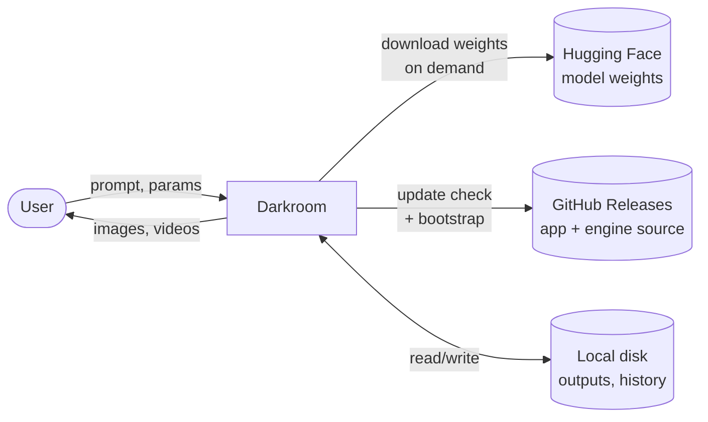
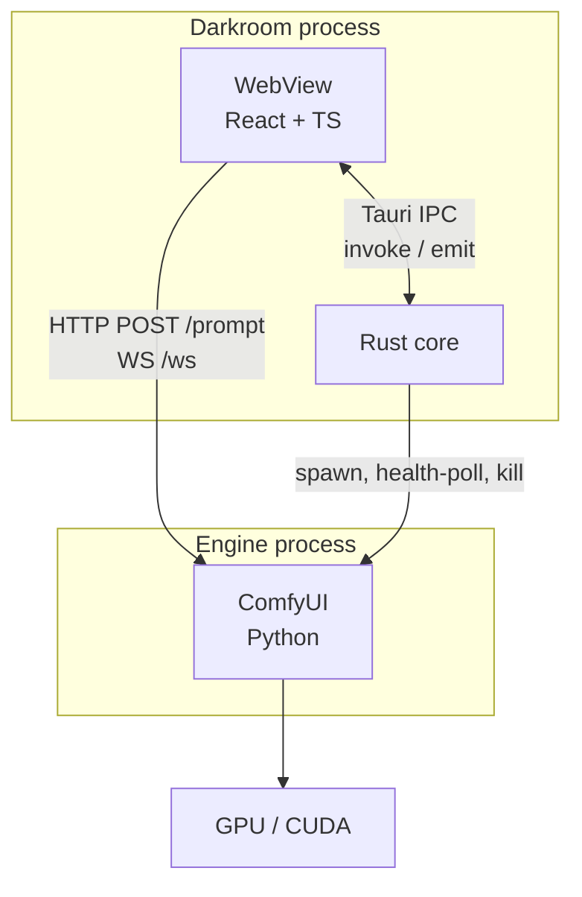
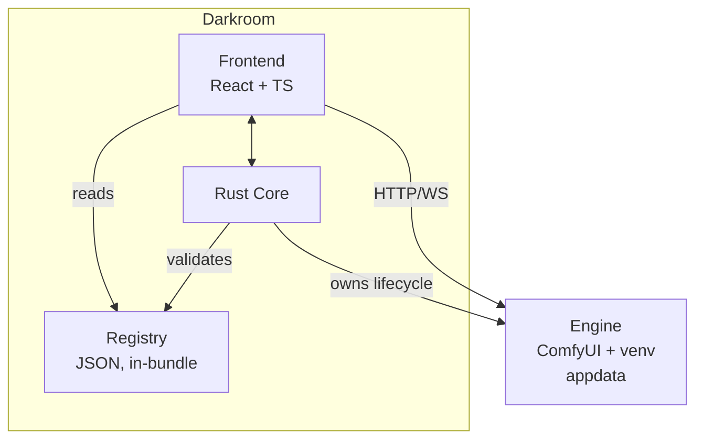
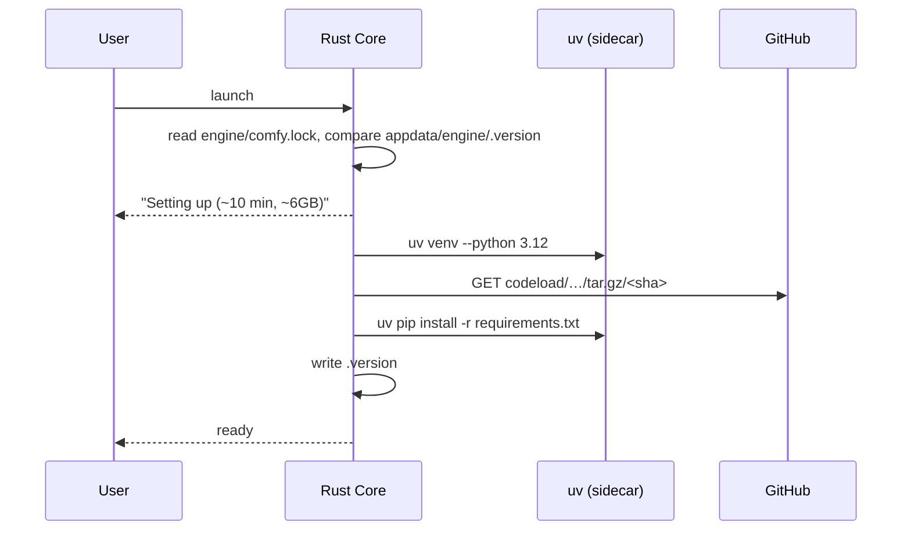
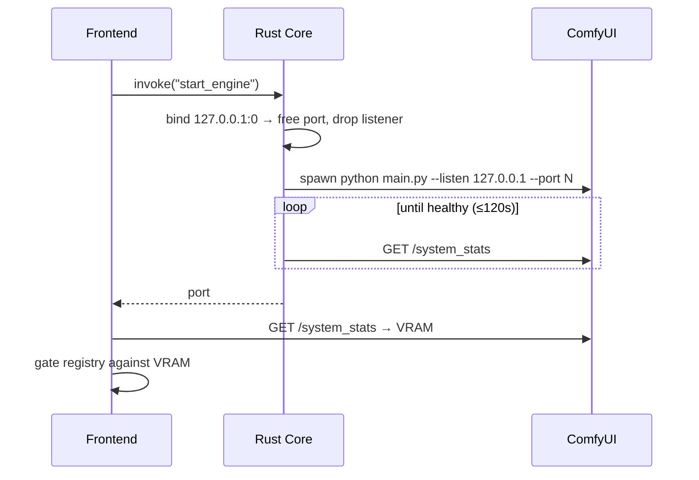
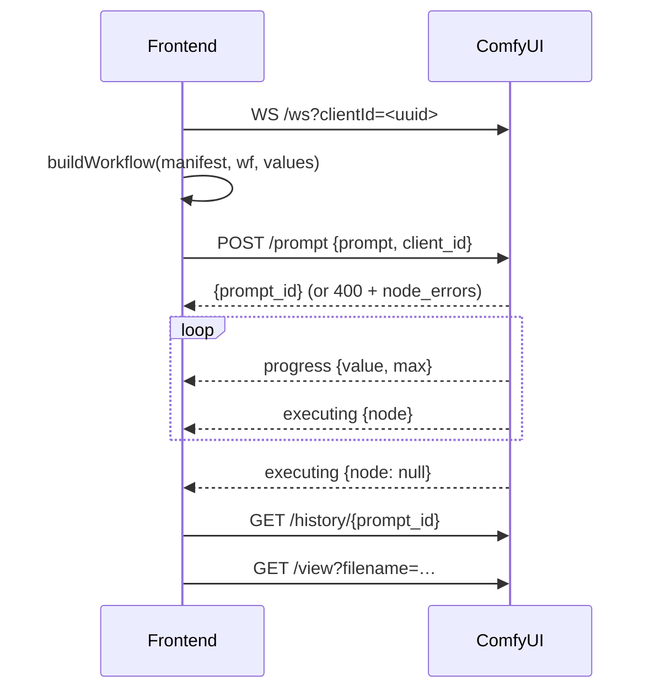
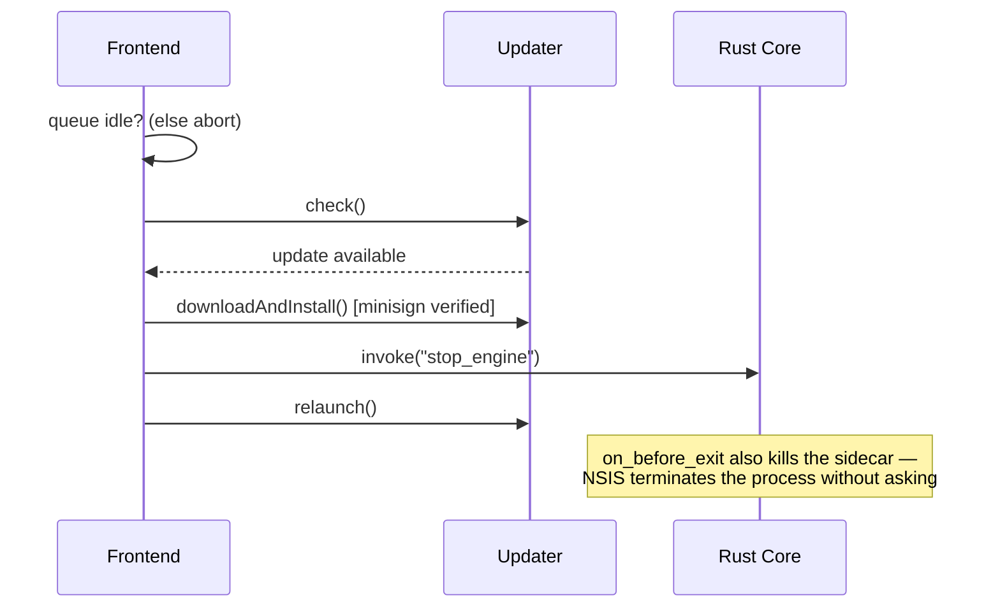
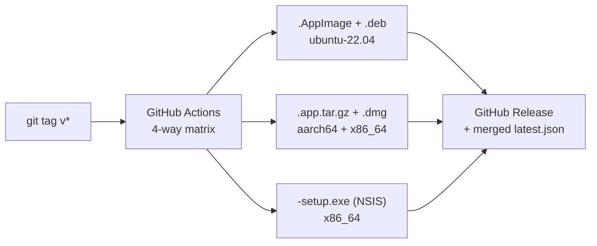

# Darkroom — Architecture Documentation

> Follows the [arc42](https://arc42.org) template (v8.2).
> Status: draft · Version: 0.1.0 · Last updated: 2026-07-15

---

## 1. Introduction and Goals

Darkroom is a desktop application for generating images and short videos with AI models that run **entirely on the user's own GPU**. No cloud, no API keys, no per-generation cost, no prompt leaves the machine.

It is open source under **GPL-3.0**.

### 1.1 Requirements Overview

| # | Requirement |
|---|---|
| FR-1 | Generate images from a text prompt, locally |
| FR-2 | Generate short video clips from a text prompt or image, locally |
| FR-3 | Work fully offline once models are installed |
| FR-4 | Download and manage model weights from within the app |
| FR-5 | Browse and re-use prior generations with their parameters |
| FR-6 | Update itself in-app on Linux, macOS and Windows |
| FR-7 | Support additional models over time without an architectural change |

Explicit **non-goals** for v1: batch/parallel production pipelines, cloud fallback, node-graph editing (that's ComfyUI's job, not ours), model training or LoRA fine-tuning, mobile.

### 1.2 Quality Goals

Ordered by priority. These drive every decision in §9.

| # | Quality Goal | Scenario / Measure |
|---|---|---|
| Q1 | **Privacy** | Zero outbound traffic during generation. Network is used only for downloads and update checks, both user-triggerable and disableable. |
| Q2 | **First-run success** | A non-technical user with a supported GPU reaches their first image without a terminal, and without a crash the app can't explain. |
| Q3 | **Extensibility** | Adding a new model is a folder drop + one-line diff — no code change. |
| Q4 | **Update safety** | An update never corrupts an install, never orphans a GPU process, and is cryptographically verified. |
| Q5 | **Honest resource behaviour** | The app never offers an option the user's hardware cannot run. |

### 1.3 Stakeholders

| Role | Expectations |
|---|---|
| End user (hobbyist creator, privacy-conscious professional) | Install, click, get an image. No Python, no CUDA debugging. |
| Maintainer | Adding a model or bumping the engine is routine, not a release crisis. |
| Contributor / model packager | Can add a model by writing two JSON files. |
| Downstream distributor (AUR, Flathub, nixpkgs) | Reproducible builds, clear license boundaries. |

---

## 2. Architecture Constraints

### 2.1 Technical Constraints

| # | Constraint | Consequence |
|---|---|---|
| TC-1 | Inference needs an NVIDIA GPU with ≥8GB VRAM | Hardware gating is a first-class feature, not an error path |
| TC-2 | ComfyUI is Python; torch is ~3GB | The engine cannot live inside the app bundle |
| TC-3 | Tauri v2 requires WebKitGTK **4.1** on Linux | Build on Ubuntu 22.04 / Debian 12 baseline |
| TC-4 | glibc is not forward-compatible | Build host = oldest supported target |
| TC-5 | `linuxdeploy` cannot cross-compile ARM AppImages | x86_64 only on Linux for v1 |
| TC-6 | Model weights are 12–16GB each | Downloads must be resumable and verified |
| TC-7 | ComfyUI has no stable API contract | The engine commit must be pinned |

### 2.2 Organisational & Legal Constraints

| # | Constraint | Consequence |
|---|---|---|
| OC-1 | ComfyUI is **GPL-3.0** | Darkroom is GPL-3.0. This resolves the licensing question rather than working around it. |
| OC-2 | Model licenses vary (FLUX.1-dev and FLUX.2-dev are non-commercial; Apache-2.0 models are not) | Every manifest declares its license; only permissive models ship by default |
| OC-3 | macOS notarization requires a paid Apple Developer account | See RISK-2 |
| OC-4 | Single/small maintainer team | Prefer boring, well-trodden paths over clever ones |

---

## 3. Context and Scope

### 3.1 Business Context



| Partner | Direction | Content |
|---|---|---|
| User | in/out | Prompts and parameters in; media out |
| Hugging Face | out | Weight downloads. On demand only, never at install |
| GitHub Releases | out | `latest.json` update manifest, signed bundles, pinned ComfyUI tarball |
| Local disk | both | Outputs, prompt history, models, engine |

**There is no analytics endpoint, no license server, and no inference backend.** That absence is the product.

### 3.2 Technical Context



| Channel | Protocol | Notes |
|---|---|---|
| WebView ↔ Rust | Tauri IPC | Capability-scoped commands |
| WebView ↔ Engine | HTTP + WebSocket on `127.0.0.1:<dynamic>` | Bound to loopback, never `0.0.0.0` |
| Rust ↔ Engine | process lifecycle + `/system_stats` | Rust owns the process; the frontend owns the conversation |
| Engine ↔ GPU | CUDA via torch | Opaque to us |

---

## 4. Solution Strategy

| Quality Goal | Strategy |
|---|---|
| Q1 Privacy | All inference is a local subprocess on loopback. No telemetry code exists to be disabled. |
| Q2 First-run | Bundle only `uv` (~30MB); provision Python, torch and ComfyUI on first run with real progress reporting. Keeps the AppImage ~80MB instead of ~3GB. |
| Q3 Extensibility | A model = `{manifest.json, workflow.json}`. The manifest maps UI fields to ComfyUI node IDs; the workflow stays byte-identical to ComfyUI's API-format export. |
| Q4 Update safety | Three independent, individually-verified update tracks (§8.2). Minisign for the app, SHA-256 for weights, pinned SHA for the engine. |
| Q5 Resources | Read real VRAM from `/system_stats` at boot; gate the registry against it before rendering the model picker. |

The overarching bet: **integrate, don't reimplement.** ComfyUI already solves VRAM offloading, quantization, scheduler wiring, and same-week support for new architectures. Darkroom's value is the 5% that ComfyUI deliberately doesn't do: being an app.

---

## 5. Building Block View

### 5.1 Level 1 — Whitebox: Darkroom



| Building block | Responsibility |
|---|---|
| **Frontend** | UI, queue state, gallery, workflow patching, all engine conversation |
| **Rust Core** | Process lifecycle, downloads, filesystem paths, manifest validation, updates |
| **Registry** | Declarative model definitions. Data, not code. Ships inside the signed bundle. |
| **Engine** | ComfyUI. Third-party, pinned, treated as a black box behind its HTTP API. |

**Why the frontend talks to the engine directly:** proxying `/prompt` and the progress WebSocket through Rust would add a hop and buy nothing — the engine is on loopback and already speaks HTTP. Rust owns the process; the frontend owns the protocol.

### 5.2 Level 2 — Whitebox: Rust Core

| Module | Responsibility | Key risk it absorbs |
|---|---|---|
| `sidecar.rs` | Free-port allocation, spawn, health-poll, log pump, guaranteed teardown | Orphaned 6GB GPU process |
| `download.rs` | Resumable, SHA-256-verified fetch; `.part` → atomic rename | Corrupt 15GB weights; CDNs ignoring `Range` |
| `registry.rs` | Parse manifests, validate against VRAM and disk | Offering Wan 2.2 on a 3060 |
| `paths.rs` | Single source of truth for appdata layout | Path drift across three OSes |

### 5.3 Level 2 — Whitebox: Frontend

| Module | Responsibility |
|---|---|
| `lib/comfy.ts` | `Comfy` client: `/prompt`, WS events, `/history`, `/view`, `/system_stats` |
| `lib/workflow.ts` | `buildWorkflow()` — patches values into an untouched API-format export |
| `lib/registry.ts` | Manifest loading, VRAM gating, staged-model filtering |
| `stores/` | Queue and gallery state (zustand) |

### 5.4 Level 2 — Blackbox: Registry

```
registry/
├── flux2-klein/         # image, default,  Apache-2.0
│   ├── manifest.json
│   └── workflow.json    # ComfyUI API format
├── ltx-video/           # video, default,  ~8GB floor
└── _staged/             # built and tested, enabled: false
    ├── wan22/
    └── z-image-turbo/
```

Manifest schema:

```jsonc
{
  "id": "flux2-klein",
  "kind": "image",              // image | video
  "enabled": true,
  "license": "Apache-2.0",
  "requires": { "vram_gb": 13, "disk_gb": 14 },
  "files": [{ "url": "…", "dest": "models/…", "sha256": "…", "size": 13421772800 }],
  "workflow": "workflow.json",
  "params": {                   // UI field → ComfyUI node input
    "prompt": { "node": "6",  "field": "text" },
    "seed":   { "node": "25", "field": "noise_seed" },
    "steps":  { "node": "17", "field": "steps", "default": 4, "max": 8 }
  },
  "output_node": "9"
}
```

`_staged/` is the concrete form of the "middle path": models are fully built and tested but shipped disabled. Promoting one is a one-line diff plus a tagged release.

---

## 6. Runtime View

### 6.1 First Run (bootstrap)



Runs ~10 minutes and downloads ~6GB. It needs a real progress UI with a byte counter, not a spinner. No `git` is required — the pinned SHA is fetched as a tarball.

### 6.2 Engine Start



A dynamic port is chosen deliberately: 8188 is very likely occupied by the user's own ComfyUI.

### 6.3 Generation



`client_id` must match on the WebSocket and in the `/prompt` body, or no progress events arrive.

### 6.4 App Update



---

## 7. Deployment View

### 7.1 Build & Distribution



| Platform | Ship | Updater artifact | Runner |
|---|---|---|---|
| Linux | `.AppImage`, `.deb` | AppImage reused + `.sig` | ubuntu-22.04 |
| macOS | `.dmg` ×2 | `.app.tar.gz` + `.sig` | macos-latest |
| Windows | NSIS `-setup.exe` | installer reused + `.sig` | windows-latest |

Each matrix job merges its platform key into a single `latest.json` (`includeUpdaterJson: true`). Releases are created as drafts and published only when all four jobs are green — a draft release's assets are not reachable at `/releases/latest/download/`.

### 7.2 Target Environment

```
<appdata>/darkroom/
├── engine/
│   ├── .venv/          # uv-managed          ~6 GB
│   ├── ComfyUI/        # pinned SHA, tarball
│   └── .version        # matches comfy.lock when healthy
├── models/             # 12–16 GB per model
├── outputs/
└── darkroom.db         # prompt history, SQLite
```

| Node | Requirement |
|---|---|
| Minimum | NVIDIA 8GB VRAM (LTX-Video, quantized images) |
| Recommended | 16GB VRAM (FLUX.2 klein comfortably) |
| Video finals | 24GB+ (Wan 2.2, staged) |
| Disk | ~6GB engine + 12–16GB per model |

---

## 8. Cross-cutting Concepts

### 8.1 The Registry Concept

The core structural idea. A model is **data**, not code:

- `workflow.json` is ComfyUI's own API-format export, unmodified.
- `manifest.json` maps UI fields to node IDs and inputs.
- `buildWorkflow()` deep-clones and patches values in at submit time.

Because nothing about a model is hardcoded, supporting Wan 2.2 later is a folder plus `"enabled": true`. This concept is what §1.2/Q3 buys, and it is the single highest-leverage decision in the system.

The registry ships **inside the bundle**, so the app's minisign signature covers it for free. A workflow JSON is effectively a node graph executed by the engine — treating it as untrusted remote data would demand a separate signing scheme for no benefit.

### 8.2 Three Update Tracks

| Track | Mechanism | Verification | Trigger |
|---|---|---|---|
| App (incl. registry) | Tauri updater, `latest.json` | minisign | user, when queue idle |
| Engine | `comfy.lock` vs `.version` | pinned commit SHA | boot, on mismatch |
| Weights | `download.rs` | SHA-256 | user, on demand |

They are independent because they have different sizes (80MB / 6GB / 15GB), different cadences, and different failure modes. Coupling them would mean re-downloading torch for a UI fix.

**Version skew is the hazard:** an app update may ship a workflow that needs newer engine nodes. Generation is therefore blocked until `.version == comfy.lock`.

### 8.3 Process Lifecycle

The engine is a child process holding several GB of VRAM. Teardown is mandatory in three places:

1. `RunEvent::ExitRequested` — normal quit
2. `updater::Builder::on_before_exit` — NSIS terminates the process to swap the exe
3. PID file checked at next boot — hard crashes and SIGKILL

Anything less leaves a zombie holding the GPU, and the next launch fails with an OOM the user cannot explain.

### 8.4 Integrity & Security

| Surface | Control |
|---|---|
| App updates | minisign; private key is the entire trust chain |
| Weights | SHA-256 in the manifest; `.part` → atomic rename, so presence == valid |
| Engine | pinned commit SHA |
| Engine binding | `127.0.0.1` only |
| IPC | Tauri capabilities scoped per command — never `"*"` |
| CSP | `connect-src` must allow `http://127.0.0.1:* ws://127.0.0.1:*` (the port is dynamic). Do **not** disable CSP to work around this. |

### 8.5 Resource Gating

Read `vram_total` from `/system_stats` at boot. Compare against `requires.vram_gb`. Disable — don't hide — models that don't fit, with the reason shown. Check free disk against `sum(files.size) * 1.1` *before* a download starts.

### 8.6 Error Handling

The engine fails in Python, far from the user. Every failure must arrive as something actionable:

- `/prompt` 400 → surface `node_errors`, which name the offending node.
- Spawn failure → surface the tail of the engine log, not "an error occurred".
- Health timeout → the log pump is the only diagnostic; keep `PYTHONUNBUFFERED=1` or logs arrive in 4KB lumps and truncate exactly when it matters.

### 8.7 Offline Operation

After bootstrap and one model, the app is fully functional with the network off. Update checks are the only outbound traffic and must be skippable.

---

## 9. Architecture Decisions

### ADR-001 — Integrate ComfyUI rather than use Diffusers directly

**Status:** accepted
**Context:** We need local inference for both images and video, across models that change every few months.
**Decision:** Run ComfyUI headless as a subprocess and drive it over HTTP/WS.
**Rationale:** ComfyUI has best-in-class VRAM management (offloading, tiling), GGUF loading, and new architectures land within days of release. Diffusers would mean re-implementing offloading and quantization ourselves and doing real work for every new model.
**Consequences:** We inherit a Python dependency and GPL-3.0 (see ADR-002). We must pin the commit (TC-7).
**Alternatives:** Diffusers (Apache-2.0, cleaner, far more work); custom pipeline (rejected outright).

### ADR-002 — License Darkroom as GPL-3.0

**Status:** accepted
**Context:** ComfyUI is GPL-3.0. A separate process talked to over HTTP is generally considered arm's length, but any custom node we write is unambiguously derivative.
**Decision:** Open source under GPL-3.0.
**Rationale:** Dissolves the question instead of engineering around it. Custom nodes become an option rather than a legal problem.
**Consequences:** No proprietary fork. Model licenses remain a separate axis (OC-2).

### ADR-003 — Tauri over Electron

**Status:** accepted
**Decision:** Tauri 2 + React + TypeScript.
**Rationale:** ~80MB vs ~200MB+, far less RAM, and the sidecar system fits process management natively. The UI is simple and the GPU does the work, so Electron's rendering-consistency advantage buys nothing here.
**Consequences:** WebKitGTK 4.1 and glibc constraints (TC-3, TC-4); no cross-compiled ARM AppImage (TC-5).

### ADR-004 — Bootstrap Python with `uv`; do not bundle it

**Status:** accepted
**Context:** torch is ~3GB. Bundling makes an ~3GB AppImage, and every 80MB UI fix re-downloads all of it.
**Decision:** Ship `uv` (~30MB static) as the only sidecar binary; provision the venv and ComfyUI into appdata on first run.
**Rationale:** Keeps the bundle ~80MB and decouples the update tracks (§8.2).
**Consequences:** A ~10 minute first run that needs a real progress UI and can fail on a bad network — the main cost of this decision.
**Alternatives:** Bundle everything (rejected: bundle size, update cost); require a system Python (rejected: destroys Q2).

### ADR-005 — Model registry as data

**Status:** accepted
**Decision:** A model is `{manifest.json, workflow.json}`; the manifest maps UI fields to node IDs.
**Rationale:** Directly serves Q3. Lets us ship one image + one video model while keeping others staged and tested.
**Consequences:** Manifests can go stale against a workflow; `buildWorkflow()` must fail loudly on a missing node ID rather than silently ignoring it.

### ADR-006 — Ship FLUX.2 klein and LTX-Video; stage the rest

**Status:** accepted
**Decision:** Defaults are FLUX.2 klein (image) and LTX-Video (video). Wan 2.2 and Z-Image Turbo are built but disabled.
**Rationale:**
- *klein over Z-Image Turbo:* both Apache-2.0; klein is smaller (4B vs 6B), needs fewer steps, and inherits FLUX's LoRA/ControlNet ecosystem — which is how style presets and pose control get added later without training anything. Z-Image wins only on Chinese text rendering.
- *LTX over Wan 2.2:* Wan is the better model but the wrong default. LTX's ~8GB floor sits below the image model's, so no user hits a "your GPU is too weak" wall inside our own app; and ~30s is a usable wait where Wan's multi-minute renders are not.
- *Staging over a model picker:* every model is a separate workflow to maintain and test, ~12–16GB of download, and minutes of reload time on switch. ~1–2 weeks of work plus permanent upkeep, for a choice most users cannot evaluate.
**Consequences:** Users wanting maximum quality must wait for Wan to be promoted.

### ADR-007 — Dynamic engine port

**Status:** accepted
**Decision:** Bind `127.0.0.1:0`, take the port, drop the listener, pass it to ComfyUI.
**Rationale:** Our users are exactly the population most likely to already run ComfyUI on 8188.
**Consequences:** Theoretically racy, fine in practice. CSP must wildcard the loopback port (§8.4).

### ADR-008 — Frontend talks to the engine directly

**Status:** accepted
**Decision:** Rust owns the process; the frontend owns the HTTP/WS conversation.
**Rationale:** Proxying through Rust adds a hop and re-implements a protocol the WebView already speaks natively. Progress events are high-frequency; the IPC bridge is the wrong place for them.
**Consequences:** Engine URL construction lives in the frontend; CSP becomes load-bearing.

### ADR-009 — Vouch-based contributor trust, labelling only

**Status:** accepted
**Context:** Open source in 2026 receives high volumes of low-comprehension, AI-generated PRs. Maintainer attention is the scarcest resource in the project (OC-4). Meanwhile the contribution we most need — a model manifest verified on hardware we don't own (§11/TD-2, TD-4) — necessarily comes from people who have never contributed before.
**Decision:** Adopt `mitchellh/vouch` with `.github/VOUCHED.td`. PRs are **labelled** `vouch:trusted` / `vouch:unvouched` / `vouch:denounced`. Nothing is auto-closed except denounced authors. Trust-list edits go through a PR, never a direct push.
**Rationale:** Auto-closing unvouched PRs would optimise for maintainer convenience and against the project's actual bottleneck. Labelling gives triage ordering without turning a first-time contributor away. Denouncement remains available for bad actors, and is kept in-file rather than using GitHub blocks so other projects can adopt our prior knowledge.
**Consequences:** No automated protection from PR volume — the label only helps if maintainers use it. Registry PRs warrant extra scrutiny regardless of label, because a manifest is a download instruction and a workflow is a graph the engine executes (§8.4).
**Alternatives:** `check-pr` with `auto-close: true` (rejected: kills TD-4's only fix); no system (rejected: the volume is real).

### ADR-010 — Test everything except the GPU; attest the rest

**Status:** accepted
**Context:** CI runners have no GPU. No hosted CI can execute a single generation, and self-hosted GPU runners on a public repo would execute untrusted PR code on hardware we own.
**Decision:** Structure tests to catch failures without inference. Registry cross-validation (manifest `params` node IDs resolve against the workflow) is the primary gate. Model behaviour is covered by a mandatory `tested_on` attestation in each manifest — GPU, VRAM, seconds, ComfyUI SHA — supplied by whoever packaged it.
**Rationale:** The registry check catches ADR-005's predicted failure mode in ~10s with no hardware. Everything else — resume logic, path handling, VRAM gating, `buildWorkflow` — is pure logic and testable normally. Output quality is not machine-checkable; a perceptual-hash assertion would fail on driver updates and teach the team to ignore red CI.
**Consequences:** The engine boundary is only ever exercised against a mock built from recorded traffic. A ComfyUI SHA bump can pass CI green and still break every workflow (RISK-1) — hence the manual re-test in the runbook. Attestation is trust-based and unverifiable, which is one more reason ADR-009 exists.
**Alternatives:** Self-hosted GPU runners (rejected: executing fork code on our hardware); no model testing (rejected: TD-4 is already the weakest point).

### ADR-011 — CodeRabbit as advisory reviewer; enforce commit format at the PR title

**Status:** accepted
**Context:** Maintainer attention is the bottleneck (OC-4, ADR-009). Most PRs come from first-time contributors. We also want a generated changelog, which needs machine-readable commit messages — but outside contributors don't install git hooks, and `--no-verify` exists.
**Decision:** (a) CodeRabbit on every non-draft PR with `request_changes_workflow: false`, configured with path-scoped instructions encoding our invariants, and `knowledge_base.code_guidelines` pointed at this document. (b) Squash-merge only; the PR title is the commit message and is linted in CI against Conventional Commits. `commitlint` + husky is local best-effort only.
**Rationale:** CodeRabbit reads its config from the base branch, so a fork cannot silence review of its own PR — that makes the config a real control surface, and the path instructions are where the traps live (the `pull_request_target` checkout vector, the `.part` collision, the Range-206 reset, sidecar teardown). Pointing it at ARCHITECTURE.md means it reviews against ADRs rather than generic advice. Keeping it non-blocking preserves ADR-009's stance: the tool triages, humans decide.
Under squash-merge the branch's individual commits are discarded, so linting them is enforcement theatre; the title is the only artifact that survives and the only one CI can gate.
**Consequences:** An advisory bot can be ignored, and will be, on a busy day. CodeRabbit has no GPU and cannot detect the one thing we most need caught — a fabricated `tested_on` (RISK-9). Squash-only loses granular history within a PR, which we accept. Scope lists now exist in two files (`commitlint.config.mjs`, `pr-title.yml`) and must be kept in sync — see TD-6.
**Alternatives:** `request_changes_workflow: true` (rejected: a bot blocking a first-time contributor's model PR is precisely ADR-009's failure mode); merge commits with per-commit linting (rejected: unenforceable across forks); no AI review (rejected: it's a cheap first pass against exactly the PR volume ADR-009 anticipates).

### ADR-012 — Repository layout: `app/` and `native/`

**Status:** accepted
**Context:** `create-tauri-app` produces `src/` for the webview code and `src-tauri/` for the Rust crate. Both names describe the tool that generated them rather than what they hold, and `src-tauri/src/` nests a second `src` inside the first. The scaffold hardcoded those paths in `ci.yml` (working directories and the rust-cache workspace), `CLAUDE.md`, `CONTRIBUTING.md`, `docs/BACKLOG.md` and `.coderabbit.yaml`'s path-scoped review rules.
**Decision:** The webview side lives in `app/`, which is also Vite's `root` — so `index.html` sits with the code it loads rather than at the repo root. Everything cargo builds lives in `native/`. No directory is named after the tool that produced it. Tests sit with their subject rather than in a top-level `tests/`: unit tests next to the code (`app/**/*.test.tsx`), Rust tests as cargo `#[test]` in `native/`, and the manifest validation suite in `registry/`, which is the data it gates.
**Rationale:** The Tauri CLI locates `tauri.conf.json` by searching rather than by requiring the literal `src-tauri` name; this was verified with `tauri info` against a renamed directory before any of it was committed, not assumed. `native/` says what is inside it, and avoids `engine/`, which in this project already means the ComfyUI subprocess (ADR-001) — reusing it for the Rust crate would be actively misleading. Making `app/` the Vite root is what lets `index.html` leave the top level.
**Consequences:** This diverges from every Tauri tutorial and from upstream docs, so a contributor pasting an upstream snippet will reference paths that don't exist; `CONTRIBUTING.md` and `CLAUDE.md` carry the real commands. The path lists in `ci.yml`, `.coderabbit.yaml` and the docs had to move together, and a future path-scoped CodeRabbit rule copied from upstream will silently match nothing — a rule that matches no files fails open, quietly. Vitest projects must re-root at the repo, because Vite's `root` is `app/` and include globs would otherwise resolve under it. Putting the suite inside `registry/` means the lint and format ignores for that directory can no longer be blanket: they are scoped to `registry/**/*.json` so the manifests stay untouched while the suite is still checked — an ignore that swallows a test file is the kind of thing nobody notices for a year.
**Alternatives:** Keep `src/` + `src-tauri/` (rejected: the scaffold's own instruction, but the names are tooling artifacts and the nested `src` is a papercut every contributor pays); rename only `src-tauri/` (rejected: halves the churn but keeps the asymmetry that caused the objection); a monorepo of `apps/*` + `packages/*` (rejected: one app and one crate — the indirection buys nothing today).

---

## 10. Quality Requirements

### 10.1 Quality Tree

```
Darkroom
├── Privacy (Q1)
│   ├── No outbound traffic during generation
│   └── Fully functional offline
├── Usability (Q2)
│   ├── First run without a terminal
│   └── Failures are actionable
├── Maintainability (Q3)
│   └── New model = folder drop
├── Reliability (Q4)
│   ├── Verified updates
│   └── No orphaned GPU processes
└── Efficiency (Q5)
    └── Never offer what the hardware can't run
```

### 10.2 Quality Scenarios

| # | Goal | Scenario | Expected |
|---|---|---|---|
| QS-1 | Q1 | User disconnects the network and generates | Succeeds; no error, no degraded mode |
| QS-2 | Q2 | Fresh install on a supported GPU | First image without a terminal; setup shows bytes and ETA |
| QS-3 | Q2 | A workflow references a node missing from the installed engine | Named error identifying model and node; generation blocked, not crashed |
| QS-4 | Q3 | Maintainer promotes Wan 2.2 | One-line diff (`enabled: true`) + tag; no code change |
| QS-5 | Q4 | Update lands mid-render | Update deferred until the queue is idle |
| QS-6 | Q4 | App is force-killed during generation | Next launch detects the stale PID and reclaims the GPU |
| QS-7 | Q4 | Weight download interrupted at 12/14GB | Resumes; `.part` re-hashed; corrupt result never renamed into place |
| QS-8 | Q5 | 8GB card, Wan 2.2 staged and enabled | Shown disabled with the VRAM reason — never an OOM |
| QS-9 | Q4 | Tampered update served | minisign rejects it; app stays on the current version |

---

## 11. Risks and Technical Debt

| # | Risk | Impact | Mitigation |
|---|---|---|---|
| RISK-1 | **ComfyUI has no API contract.** A bumped SHA can silently break workflows. | High | Pin the SHA; block on version skew; re-test every registry workflow before bumping. Permanent tax of ADR-001. |
| RISK-2 | **macOS notarization.** Without a paid Apple cert, Gatekeeper quarantines both the app and the updater's replacement bundle. | High | Decide deliberately. Unsigned + `xattr -dr com.apple.quarantine` docs is legitimate for OSS, but it is the difference between "runs" and "is damaged and can't be opened". |
| RISK-3 | **Signing key loss or leak.** Loss = no user can ever update again. Leak = anyone can push a payload to every user. | Critical | Offline backup; CI secrets only; never in the repo. |
| RISK-4 | **Hugging Face URL rot.** Weights move or vanish; the app becomes an empty shell. | High | Pin revisions in URLs; mirror strategy is TBD. |
| RISK-5 | **Model licenses drift.** A model relicenses, or a user assumes commercial rights we never granted. | Medium | `license` in every manifest; surface it in the UI. |
| RISK-6 | **First-run failure modes are broad** — network, disk, driver, CUDA. Failures happen before any UI exists to explain them. | Medium | Log pump from byte zero; check disk before download; keep the bootstrap resumable. |
| RISK-7 | Orphaned engine process holds VRAM. | Medium | Three-way teardown (§8.3). |
| RISK-8 | Bootstrap re-downloads ~6GB when a version bumps. | Low | Accepted for now. |
| RISK-9 | **No CI can test generation** (no GPU runners). Green CI does not mean a model works. | High | Registry cross-validation + mock engine + mandatory `tested_on` attestation (ADR-010). Compounds RISK-1: a SHA bump passes CI and breaks every workflow. |
| RISK-10 | Registry PRs look like config but are download instructions and executable node graphs. | Medium | Schema pins `url` to allowlisted hosts and `dest` under `models/` (§8.4); extra review regardless of vouch label. |

### Technical Debt

| # | Debt |
|---|---|
| TD-1 | No ARM Linux build (TC-5) |
| TD-2 | No AMD/ROCm or Apple Silicon path — NVIDIA only; a real limit on the addressable audience |
| TD-3 | Free-port allocation is TOCTOU-racy |
| TD-4 | `_staged/` models are untested against real user hardware until promoted |
| TD-5 | No migration story for `darkroom.db` yet |
| TD-6 | Conventional-commit type/scope lists are duplicated in `commitlint.config.mjs` and `pr-title.yml`; they will drift |

---

## 12. Glossary

| Term | Definition |
|---|---|
| **API format** | ComfyUI's machine-readable workflow export (Settings → dev mode → *Save (API Format)*). The normal export contains UI layout data and is rejected by `/prompt`. A classic first-day time sink. |
| **appdata** | Per-user data dir (`app_data_dir()`); holds engine, models, outputs. Never the bundle. |
| **ComfyUI** | Node-based diffusion backend. GPL-3.0. Our engine. |
| **DiT / MMDiT** | Diffusion Transformer; the architecture behind FLUX, Qwen-Image and modern video models. |
| **FLUX.2 klein** | 4B image model distilled from FLUX.2's 32B. Apache-2.0. Our image default. |
| **GGUF** | Quantized weight format. Lower VRAM, some quality loss; Q4 notably softens fine detail and text. |
| **LoRA** | Low-Rank Adaptation — small adapter file adding a style or subject without retraining. |
| **LTX-Video** | Lightricks' video model, built for speed (~30s for a 5s clip on a 4090, ~8GB). Our video default. |
| **Manifest** | `manifest.json` — declarative model definition; maps UI fields to node IDs. |
| **minisign** | Signature scheme used by the Tauri updater. |
| **Registry** | `registry/` — all manifests and workflows. Data, not code. |
| **Sidecar** | External binary shipped with and spawned by a Tauri app. Ours is `uv`. |
| **Staged model** | Built and tested but `enabled: false`. The middle path. |
| **uv** | Fast Rust-based Python package/version manager. Our bootstrapper. |
| **VRAM gating** | Comparing `requires.vram_gb` against real VRAM before offering a model. |
| **Wan 2.2** | Alibaba's MoE video model. Apache-2.0, quality leader, ~22–26GB for 720p. Staged. |
| **Z-Image Turbo** | Alibaba 6B image model, ~8 steps, strong bilingual text. Apache-2.0. Staged. |

---

## Appendix — Maintainer Runbook

**Add a model**
1. Build the workflow in ComfyUI; export in **API format**.
2. `registry/_staged/<id>/` + manifest with real `sha256` and `size`.
3. Test at every VRAM tier in `requires`.
4. Promote: move out of `_staged/`, set `"enabled": true`, tag.

**Bump the engine**
1. Update `engine/comfy.lock` + `requirements.txt`.
2. Re-run every registry workflow against the new SHA.
3. Tag. Clients detect skew and re-bootstrap.

**Cut a release**
1. Version must match across `package.json`, `Cargo.toml`, `tauri.conf.json`, and the tag — otherwise the updater compares the wrong number and either loops or goes quiet.
2. Push the tag; wait for all four matrix jobs.
3. Publish the draft — a draft's assets 404 at `/releases/latest/download/`.
4. **Test the upgrade, not the install.** Almost every updater bug only exists on the second version.
